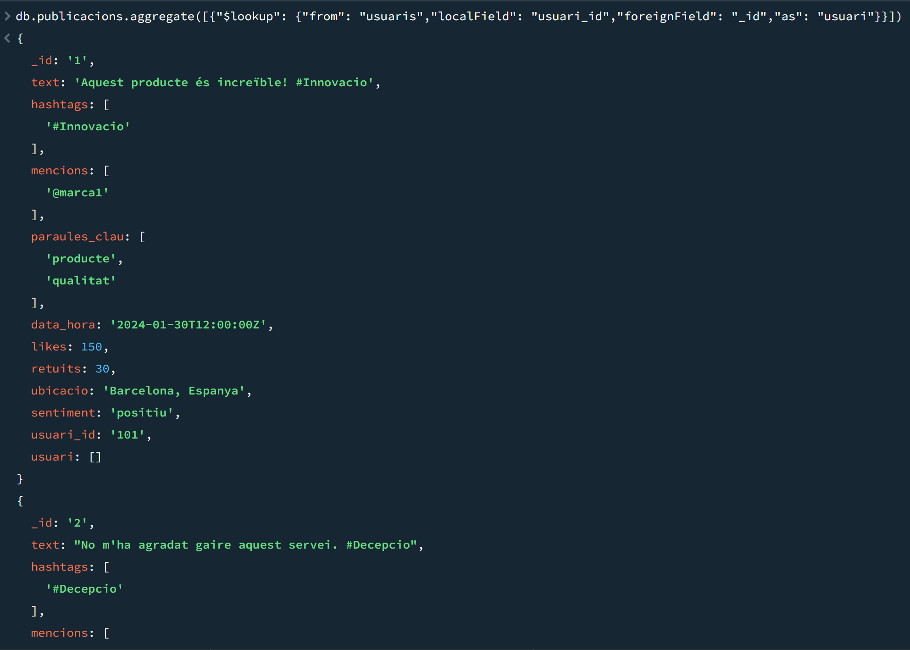

# Activitat 3 No-SQL
## 1. Disseny BBDD
Jo he definit 3 collections

1. Publicacions -> Per guardar les publicacions i les seves metadades.
2. Usuaris -> Guardar informació sobre els usuaris.
3. Tendències -> Per registrar paraules claus i hastags mes mencionats.
---
### 1. Publicacions 
```json
{
  "_id": ObjectId,
  "text": "Text de la publicació",
  "hashtags": ["#exemple", "#producte"],
  "mencions": ["@usuari1", "@usuari2"],
  "paraules_clau": ["innovació", "tecnologia"],
  "data_hora": ISODate("2024-01-30T12:00:00Z"),
  "likes": 123,
  "retuits": 45,
  "ubicacio": "Barcelona, Espanya",
  "sentiment": "positiu",
  "usuari_id": "abc123" 
}
```
### 2. Usuaris
```json
{
  "_id": "abc123",
  "nom_usuari": "usuari_exemple",
  "seguidors": 5000,
  "verificat": true
}

```
### 3. Tendencies
```json
{
  "_id": ObjectId,
  "paraula_clau": "#producte",
  "mencions_count": 230,
  "data_hora": ISODate("2024-01-30T12:00:00Z")
}
```
✅ Flexibilidad: No todas las publicaciones tienen el mismo formato. Este esquema permite manejar datos opcionales.

✅ Escalabilidad: La base NoSQL permite agregar nuevos datos sin necesidad de modificar esquemas rígidos.

✅ Eficiencia en escritura: La mayoría de las operaciones serán de inserción, y MongoDB maneja esto de manera óptima.

✅ Consultas rápidas: Indexaremos los campos clave (hashtags, usuarios, palabras clave) para mejorar la velocidad de búsqueda.

## 2. Creació de la BBDD
Yo he creado 3 archivos json, ya que tengo 3 collections. Y los he importado a mi BBDD luego de crear las 3 collections.

La primera consulta sera nomes de llistar totes les publicacions. 


Segona consulta proporciona una publicacio y les reseñas dels seus usuaris.


Tercera, mostra totes les publicacions amb la tendencia #tech
